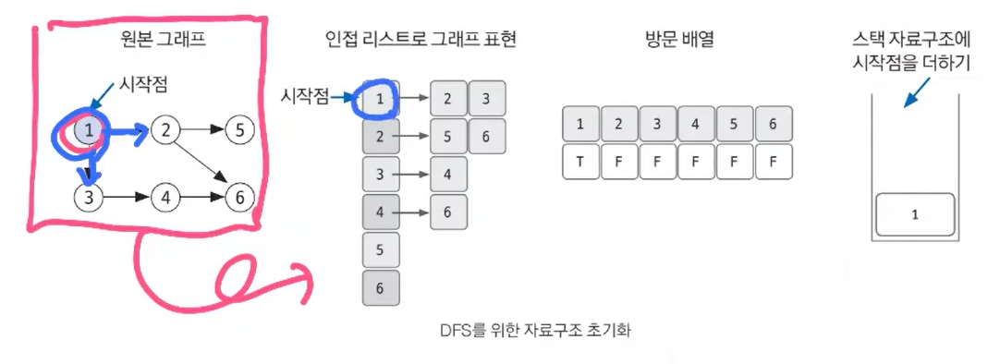
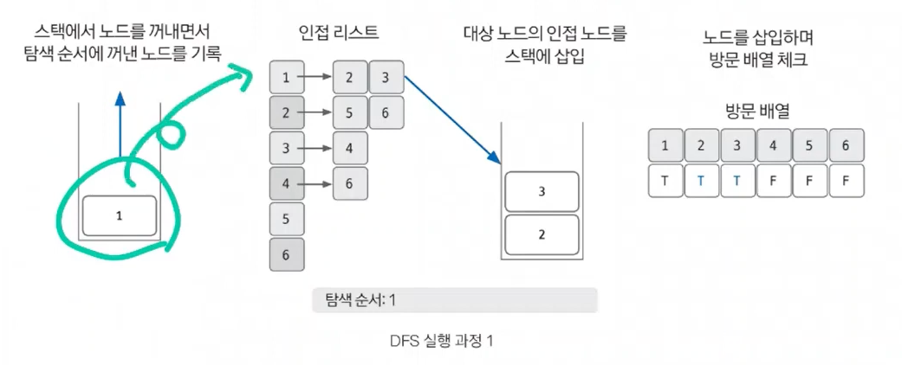
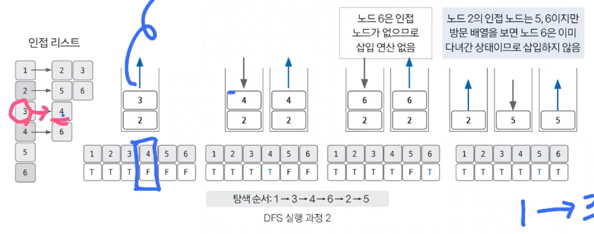
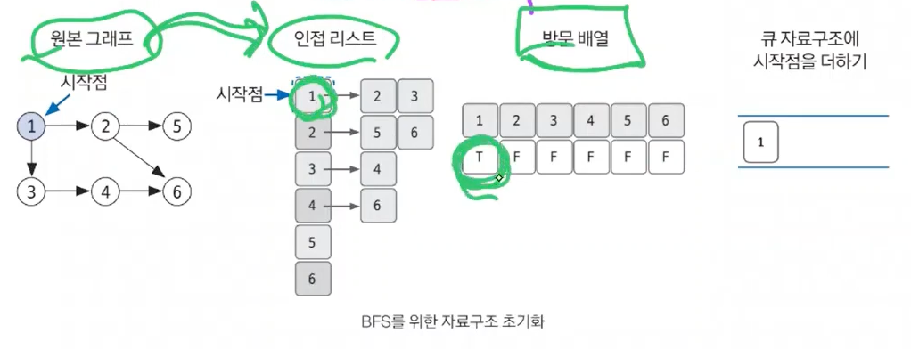
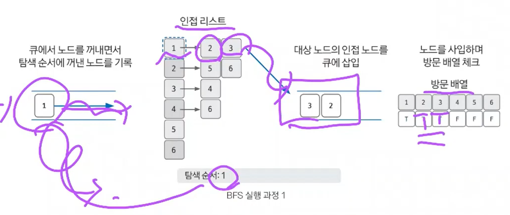
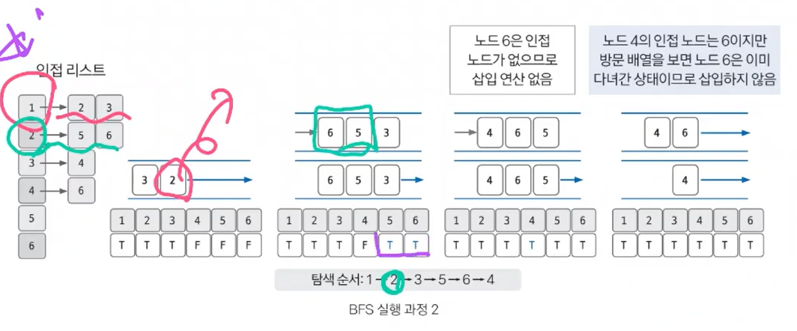
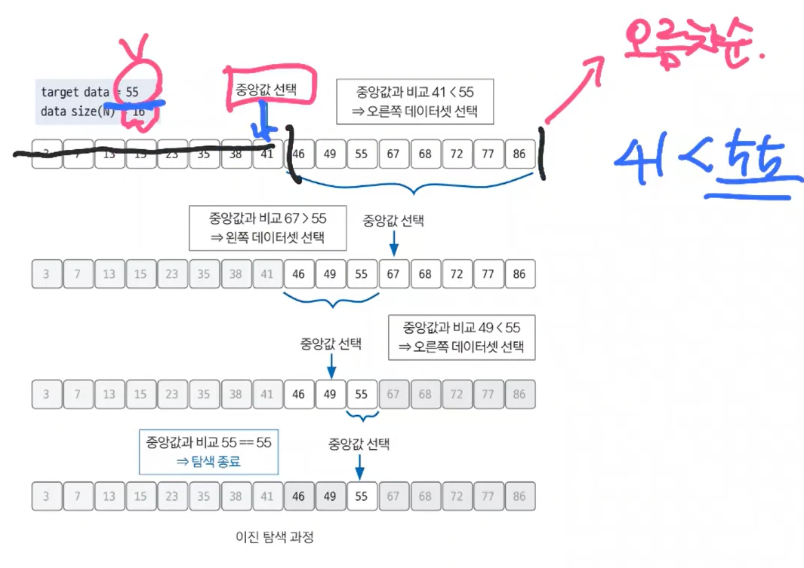

# Section3 탐색 (DFS, BFS, 이진 탐색)

## DFS(Depth-First Search)

- 깊이 우선 탐색
- 그래프 완전 탐색 기법 중 하나
- 그래프의 시작 노드에서 출발하여 탐색할 한 쪽 분기를 정하여 최대 깊이까지 탐색을 마친 후 다른 쪽 분기로 이동하여 다시 탐색을 수행하는 알고리즘
   - 스택에 노드를 삽입할 때 방문 배열을 체크하고, 스택에서 노드를 뺄 때 탐색 순서에 기록하며 인접 노드를 방문 배열과 대조하여 살핌
- 시간복잡도 (노드수: V, 엣지수 : E) → `O(V + E)`
- 단절점 찾기, 단절선 찾기, 사이클 찾기, 위상 정렬 등

### 구현 방법

- 재귀 함수로 구현 → stack overflow
- 스택 자료구조 이용 (FILO)

### 핵심 이론

- 한 번 방문한 노드를 다시 방문하면 안됨
- 노드 방문 여부 체크할 배열이 필요

### DFS 의 구현

1. DFS 를 시작할 노드를 정한 후 사용할 자료구조 초기화하기

   

2. 스택에서 노드를 꺼낸 후 꺼낸 노드의 인접 노드를 다시 스택에 삽입하기

   

3. 스택 자료구조에 값이 없을 때까지 반복하기
   - 이때 이미 방문한 노드는 스택에 쌓지 않음

   

## BFS(Breadth-Fist Search)

- 너비 우선 탐색
- 그래프를 완전 탐색하는 방법 중 하나
- 시작 노드에서 출발해 시작 노드를 기준으로 가까운 노드를 먼저 방문하면서 탐색하는 알고리즘
   - **목표 노드에 도착하는 경로가 여러 개일 때 최단 경로를 보장**
- 시간 복잡도 (노드수: V, 엣지수: E) → `O(V + E)`

### 구현 방법

- Queue 자료구조 이용 (FIFO)

### 핵심 이론

- 한 번 방문한 노드를 다시 방문하면 안됨
- 노드 방문 여부 체크할 배열이 필요

### BFS 의 구현

1. BFS 를 시작할 노드를 정한 후 사용할 자료구조 초기화하기

   

2. 큐에서 노드를 꺼낸 후 꺼낸 노드의 인접 노드를 다시 큐에 삽입하기

   

3. 큐 자료구조에 값이 없을 때까지 반복하기

   

## 이진 탐색 (Binary Search)

- 데이터가 **정렬되어 있는 상태**에서 원하는 값을 찾아내는 알고리즘
- 대상 데이터의 중앙값과 찾고자 하는 값을 비교해 데이터의 크기를 절반씩 줄이면서 대상을 찾음
- 시간복잡도 : `O(logN)`
- 원하는 데이터를 탐색할 때 사용하는 가장 일반적인 알고리즘

### 핵심 이론

1. 현재 데이터셋의 중앙값을 선택한다.
2. 중앙값 > 타깃 데이터 일 때 중앙값 기준으로 왼쪽 데이터셋을 선택한다.
3. 중앙값 < 타깃 데이터 일 때 중앙값 기준으로 오른쪽 데이터셋을 선택한다.
4. 과정 1~3을 반복하다가 중앙값 == 타깃 데이터일 때 탐색을 종료한다.

