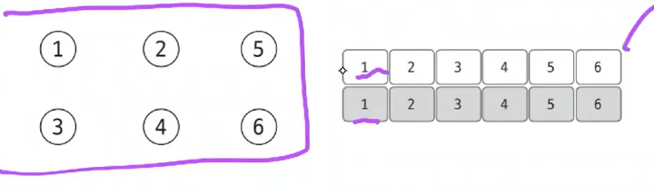

# Section6 그래프 (Graph) (유니온 파인드, 위상정렬, 다익스트라, 벨만-포드, 플로이드-워셜, 최소 신장 트리)

- 노드와 엣지로 구성된 집합
- 트리도 그래프의 일종

## 그래프의 표현

### 엣지 리스트

1. 엣지 리스트를 이용한 가중치가 없는 그래프 표현

   

    - 시작노드와 끝 노드를 기준으로 배열로 관리
    - 방향이 없는 경우 양방향 정보를 모두 저장하여 관리
2. 엣지 리스트를 이용한 가중치가 있는 그래프 표현

   

    - 특정 노드와 관련되어 있는 엣지를 탐색하기 쉽지 않음 → 벨만-포드나 크루스칼 알고리즘

### 인접 행렬

- 노드와 관련되어 있는 엣지를 탐색하려면 N 번 접근해야 하므로 노드 개수에 비해 엣지가 적을 때 공간 효율성이 떨어짐
- 노드 2번에 연결되어 있는 노드를 찾기 위해 N 번 찾아야 하므로 시간 복잡도도 높아짐
1. 인접 행렬로 가중치 없는 그래프 표현하기

   

2. 인접 행렬로 가중치 있는 그래프 표현하기

   

### 인접 리스트

1. 인접 리스트로 가중치 없는 그래프 표현하기

   

    - ArrayList 안에 배열로 관리 → 인덱스 접근 가능
    - 하나의 노드에 연결되어 있는 노드의 개수를 가변적으로 관리할 수 있음
2. 인접 리스트로 가중치 있는 그래프 표현하기

   

    - 가중치가 있을 경우 직접 객체를 선언해야 함
    - 빈 공간이 없기 때문에 시간 복잡도, 공간 복잡도 모두 뛰어남

## 유니온 파인드

- 그래프의 사이클이 생성되는지 판별하는 알고리즘
- 여러 노드가 있을 때 특정 2개의 노드를 연결해 1개의 집합으로 묶는 union 연산과 두 노드가 같은 집합에 속해 있는지를 확인하는 find 연산으로 구성되어 있는 알고리즘

### 유니온 파인드의 원리 이해하기

1. 초기화
    - 1차원 배열 이용
    - 처음에는 각 노드가 모두 대표 노드이며 배열은 자신의 인덱스 값으로 초기화

   

2. 2개의 노드를 선택해 각각의 대표 노드를 찾아 연결하는 union 연산 수행

   

3. find 연산을 통해 대표 노드 찾기
    - find 연산은 자신이 속한 집합의 대표 노드를 찾는 연산
        - 대표 노드 : 대상 노드 배열의 index == value
        - 대표 노드에 도달하면 재귀 함수를 빠져나오면서 거치는 모든 노드값을 루트 노드로 변경
    - 단순히 대표 노드를 찾는 역할만 하는 것은 아님
    - 그래프를 정돈하고 시간 복잡도를 향상시킴

## 위상 정렬

- 사이클이 없는 방향 그래프에서 노드 순서를 찾는 알고리즘
    - ex) 수강신청 (수1 과목 수강 → 수2 과목 수강)
- 정렬 순서가 하나만 존재하지 않을 수 있음
- 시간복잡도 (노드수: V, 엣지수: E) = `O(V + E)`

### 위상 정렬의 원리 이해하기

1. 주어진 그래프를 인접 리스트 형태로 정렬 후 진입 차수 배열로 초기화
    - 진입 차수 : 해당 노드로 진입할 수 있는 경우의 수

   

   

2. 진입 차수 배열에서 진입 차수가 0인 노드를 선택하고 선택된 노드를 정렬 배열에 저장, 인접 리스트에서 선택된 노드가 가리키는 노드들의 진입 차수를 1씩 뺌

   

   

   
