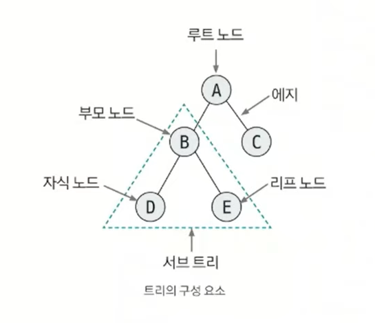
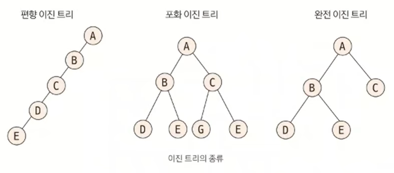
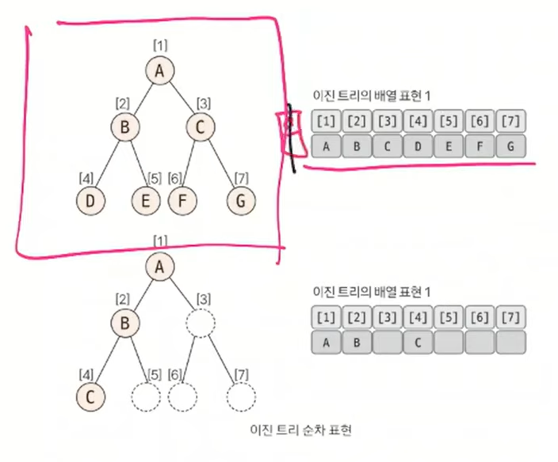
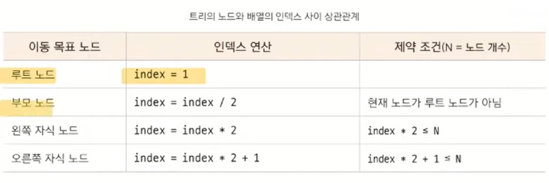
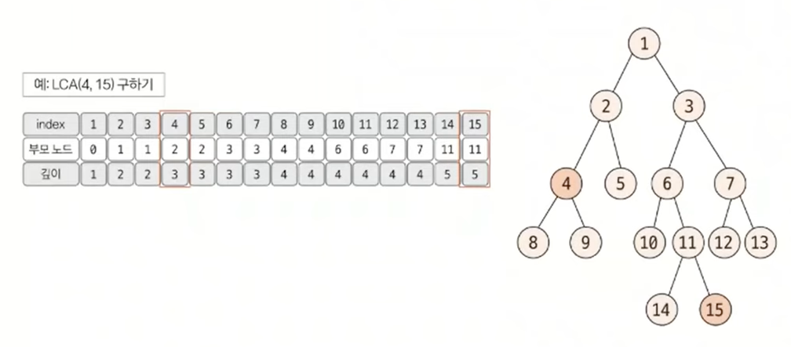
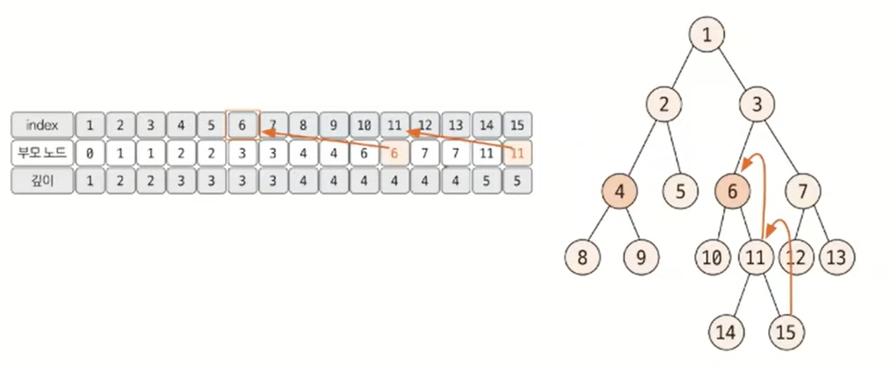
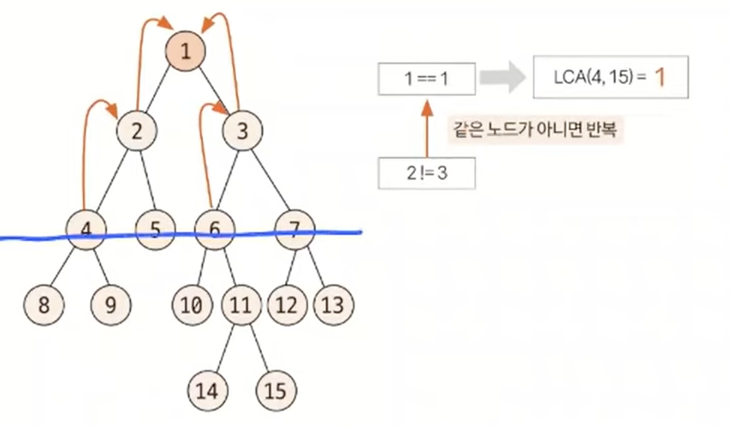

# Section7 트리 (Tree) (이진트리, 세그먼트 트리, LCA)

## 트리

- 노드와 엣지로 연결된 그래프의 특수한 형태
    - 그래프의 표현으로도 트리를 표현할 수 있음

### 트리의 특징

- 순환 구조를 지니고 있지 않고, 1개의 루트 노드 존재
- 루트 노드를 제외한 노드는 단 1개의 부모 노드를 가짐
- 트리의 부분 트리 역시 트리의 모든 특징을 따름
- 트리에서 임의의 두 노드를 이어주는 경로는 유일함

### 트리의 핵심 이론

## 코딩테스트에서의 Tree

1. 그래프로 푸는 tree
    - 그래프이기 때문에 인접리스트로 표현 가능
    - DFS, BFS 로 응용하여 풀이 가능
2. tree 만을 위한 문제
    - 이진 트리
    - 세그먼트 트리 (인덱스 트리)
        - 1차원 배열로 tree 표현
    - LCA
        - 1차원 배열로 tree 표현

## 이진 트리

- 각 노드의 자식 노드(차수)의 개수가 2 이하로 구성된 트리

### 핵심 이론

- 이진 트리의 종류

  

    - 편향 이진 트리 : 한쪽으로 편향돼 생성된 이진 트리
        - 탐색 속도가 저하되고 공간이 낭비됨
    - 포화 이진 트리 : 리프 토드가 꽉찬 이진 트리
    - 완전 이진 트리 : 마지막 레벨을 제외하고 완전하게 노드들이 채워져 있고, 마지막 레벨은 왼쪽부터 채워진 트리

### 이진 트리의 순차 표현

- 가장 직관적이면서 편리한 트리 자료구조 형태는 **배열**
    - 인덱스 0의 요소는 제외

  

## 최소 공통 조상 (LCA)

- 트리 그래프에서 임의의 두 노드를 선택했을 때 두 노드가 각각 자신을 포함해 거슬러 올라가면서 부모 노드를 탐색할 때, 처음 공통으로 만나게 되는 부모 노드를 최소 공통 조상이라고 함
    - LCA: Lowest Common Ancestor

### 핵심 이론

- 일반적인 최소 공통 조상 구하기
    - 트리의 높이가 크지 않은 경우 (시간 제한이 크지 않음)

  

    - 4번과 15번 노드의 최소 공통 조상 찾기
        - 루트 노드에서 탐색을 시작해 각 노드의 부모 노드와 깊이를 저장 (DFS, BFS)
        - 선택된 두 노드의 깊이가 다른 경우 더 깊은 노드의 노드를 부모 노드로 1개씩 올려주며 맞춤
        - 이때 두 노드가 같으면 해당 노드가 최소 공통 조상이므로 탐색 종료

          

        - 깊이가 같은 상태에서는 동시에 부모 노드로 올라가면서 두 노드가 같은 노드가 될 때까지 반복
        - 이때 처음 만나는 노드가 최소 공통 조상

          
